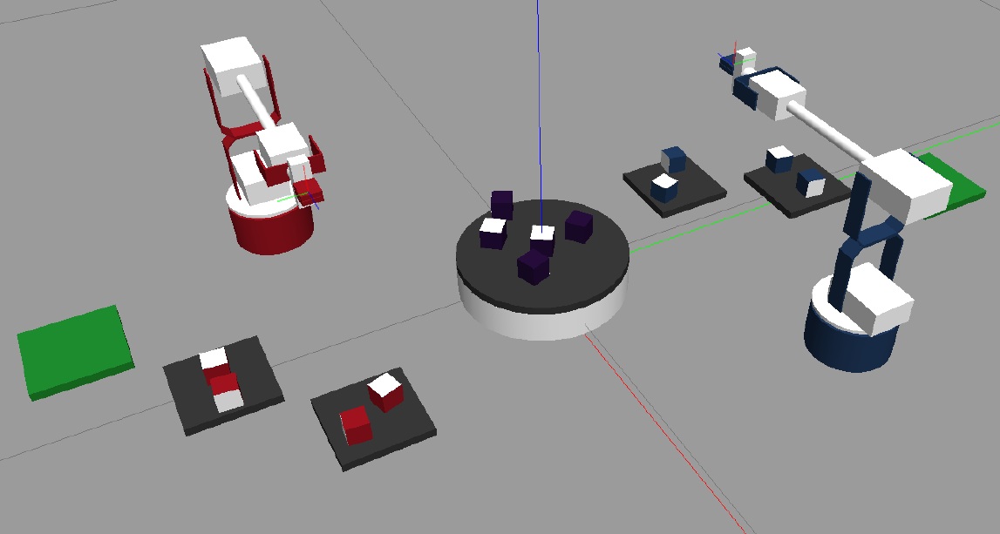

# MEAM520 Final Project

Fall 2020, Taught by Prof. Cynthia Sung

Brian Grimaldi, Venkata Gurrala, Sheil Sarda, Alexis Ward

### Overview

Teams will use the concepts learned during the semester to control their simulated Lynx robot in a
head-to-head competition with their opponents’ robot. The robots will manipulate objects in the simulated
environment to score points, culminating in a class-wide tournament.

[**Final Report detailing our strategy and implementation**](/Report/main.pdf)



### Files required to run our project in ROS + Gazebo

```sh
├── IK_velocity.py
├── calcIK.py
├── calcJacobian.py
├── calculateFK.py
├── calculateIK.py
├── detectCollision.py
├── final.py
├── gripStatic.py
├── loadmap.py
```
